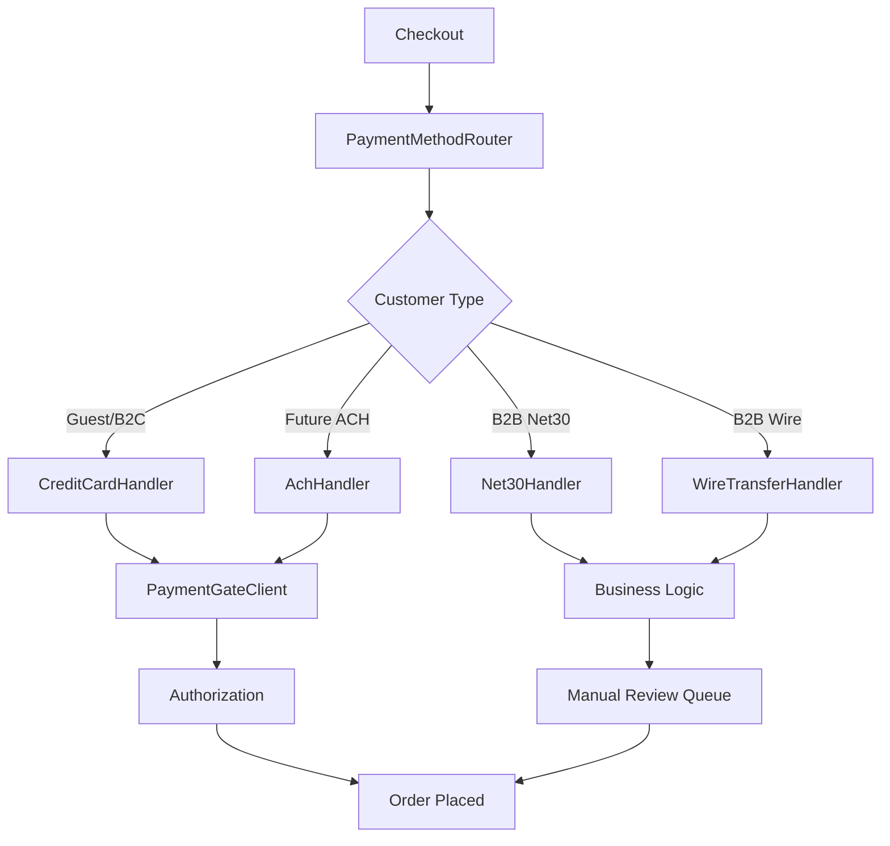
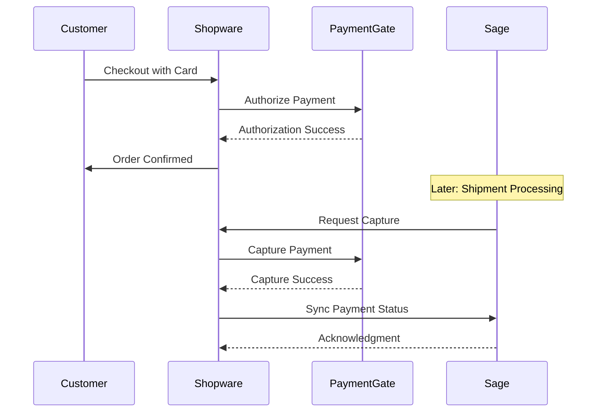
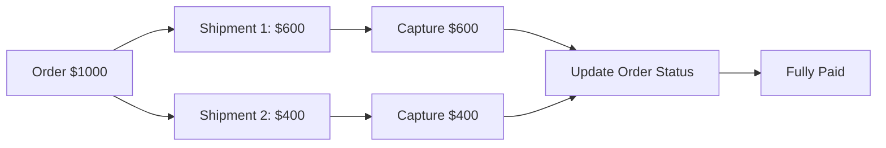

# Action Target PaymentGate Plugin - Architecture Plan

## Overview
This document outlines the architecture for the Shopware 6.7 PaymentGate integration plugin for Action Target. The plugin supports multiple payment methods, authorization-first workflows, Sage integration, and complex B2B scenarios.

## Plugin Information
- **Name**: ActionTargetPaymentGate
- **Namespace**: ActionTarget\PaymentGate
- **Shopware Version**: 6.7.8.2
- **Location**: `custom/plugins/ActionTargetPaymentGate/`

## Core Architecture Principles

### 1. Single Payment Integration
- PaymentGate is the sole payment provider
- All payment methods route through this plugin
- Extensible design for future payment types

### 2. Authorization-First Model
- Default behavior: authorize at checkout, capture later
- Capture triggered from Sage during shipment processing
- Support for multi-shipment scenarios with partial captures

### 3. Sage as System of Record
- Shopware initiates payment
- Sage manages post-order payment lifecycle
- Bidirectional synchronization required

### 4. Multi-Channel Support
- Guest checkout
- B2C logged-in customers
- B2B customers with special routing
- Admin-assisted payments

## Directory Structure

```
custom/plugins/ActionTargetPaymentGate/
├── src/
│   ├── ActionTargetPaymentGate.php          # Main plugin class
│   ├── Resources/
│   │   ├── config/
│   │   │   ├── services.xml                  # Service definitions
│   │   │   └── config.xml                    # Plugin configuration
│   │   ├── app/
│   │   │   └── administration/
│   │   │       └── src/
│   │   │           ├── module/               # Admin modules
│   │   │           └── component/            # Admin components
│   │   └── views/
│   │       ├── storefront/
│   │       │   ├── page/
│   │       │   │   └── checkout/            # Checkout templates
│   │       │   └── component/
│   │       │       └── payment/             # Payment components
│   │       └── administration/
│   │           └── page/
│   │               └── payment/             # Admin payment views
│   ├── Core/
│   │   ├── Checkout/
│   │   │   ├── Payment/
│   │   │   │   ├── PaymentHandler/
│   │   │   │   │   ├── AbstractPaymentGateHandler.php
│   │   │   │   │   ├── CreditCardHandler.php
│   │   │   │   │   ├── Net30Handler.php
│   │   │   │   │   ├── WireTransferHandler.php
│   │   │   │   │   └── AchHandler.php
│   │   │   │   ├── PaymentMethodRegistry.php
│   │   │   │   └── PaymentMethodRouter.php
│   │   │   └── Cart/
│   │   │       └── PaymentMethodValidator.php
│   │   ├── Content/
│   │   │   └── PaymentMethod/
│   │   │       ├── PaymentMethodEntity.php
│   │   │       ├── PaymentMethodDefinition.php
│   │   │       └── PaymentMethodCollection.php
│   │   └── System/
│   │       └── SalesChannel/
│   │           └── Payment/
│   │               └── PaymentMethodRoute.php
│   ├── Service/
│   │   ├── PaymentGate/
│   │   │   ├── PaymentGateClient.php        # API client
│   │   │   ├── PaymentGateAuthService.php
│   │   │   ├── PaymentGateCaptureService.php
│   │   │   ├── PaymentGateRefundService.php
│   │   │   └── PaymentGateWebhookHandler.php
│   │   ├── Sage/
│   │   │   ├── SageIntegrationService.php
│   │   │   ├── SageSyncService.php
│   │   │   └── SageWebhookHandler.php
│   │   ├── SavedPaymentMethod/
│   │   │   ├── SavedPaymentMethodService.php
│   │   │   └── TokenizationService.php
│   │   ├── Transaction/
│   │   │   ├── TransactionService.php
│   │   │   ├── TransactionLogger.php
│   │   │   └── TransactionSyncService.php
│   │   └── Routing/
│   │       ├── PaymentRoutingService.php
│   │       └── CustomerPaymentRuleEngine.php
│   ├── Storefront/
│   │   ├── Controller/
│   │   │   ├── PaymentController.php
│   │   │   ├── SavedPaymentMethodController.php
│   │   │   └── WebhookController.php
│   │   ├── Page/
│   │   │   ├── Checkout/
│   │   │   │   ├── CheckoutPaymentPage.php
│   │   │   │   └── CheckoutPaymentPageLoader.php
│   │   │   └── Account/
│   │   │       ├── PaymentMethodPage.php
│   │   │       └── PaymentMethodPageLoader.php
│   │   └── Subscriber/
│   │       ├── CheckoutSubscriber.php
│   │       └── OrderSubscriber.php
│   ├── Administration/
│   │   ├── Controller/
│   │   │   ├── PaymentAdminController.php
│   │   │   ├── TransactionController.php
│   │   │   └── ConfigurationController.php
│   │   └── Service/
│   │       ├── AdminPaymentService.php
│   │       └── CustomerPaymentMethodService.php
│   ├── Migration/
│   │   ├── Migration1000000001CreatePaymentMethodTable.php
│   │   ├── Migration1000000002CreateTransactionTable.php
│   │   ├── Migration1000000003CreateSavedPaymentMethodTable.php
│   │   ├── Migration1000000004CreatePaymentRoutingRuleTable.php
│   │   └── Migration1000000005CreatePaymentMessageTable.php
│   └── Subscriber/
│       ├── OrderStateChangeSubscriber.php
│       ├── PaymentStateChangeSubscriber.php
│       └── CustomerSubscriber.php
├── tests/
│   ├── Unit/
│   └── Integration/
└── composer.json
```

## Database Schema

### Custom Tables

#### `action_target_payment_transaction`
Tracks all payment transactions and their lifecycle.

```sql
- id (binary, PK)
- order_id (binary, FK to order)
- order_transaction_id (binary, FK to order_transaction)
- payment_gate_transaction_id (varchar)
- sage_transaction_id (varchar)
- payment_method_type (varchar)
- amount (decimal)
- currency (varchar)
- status (varchar) # authorized, captured, refunded, failed, cancelled
- authorization_code (varchar)
- capture_amount (decimal)
- refund_amount (decimal)
- metadata (json)
- created_at (datetime)
- updated_at (datetime)
```

#### `action_target_saved_payment_method`
Stores tokenized payment methods for customers.

```sql
- id (binary, PK)
- customer_id (binary, FK to customer)
- payment_gate_token (varchar)
- payment_method_type (varchar)
- last_four (varchar)
- card_brand (varchar)
- expiry_month (int)
- expiry_year (int)
- is_default (boolean)
- billing_address_id (binary, FK to customer_address)
- created_at (datetime)
- updated_at (datetime)
```

#### `action_target_payment_routing_rule`
Defines routing logic for payment method availability.

```sql
- id (binary, PK)
- name (varchar)
- priority (int)
- customer_group_id (binary, FK to customer_group, nullable)
- payment_method_type (varchar)
- conditions (json) # country, amount, customer attributes
- action (varchar) # allow, deny, route_to_manual
- is_active (boolean)
- created_at (datetime)
- updated_at (datetime)
```

#### `action_target_payment_message`
Stores customer-facing messages for payment outcomes.

```sql
- id (binary, PK)
- message_key (varchar, unique)
- payment_method_type (varchar)
- outcome_type (varchar) # success, pending, review, declined
- title (text)
- message (text)
- is_active (boolean)
- sales_channel_id (binary, FK to sales_channel, nullable)
- created_at (datetime)
- updated_at (datetime)
```

#### `action_target_sage_sync_log`
Tracks synchronization events with Sage.

```sql
- id (binary, PK)
- order_id (binary, FK to order)
- transaction_id (binary, FK to action_target_payment_transaction)
- sync_type (varchar) # capture, refund, status_update
- sage_request (json)
- sage_response (json)
- status (varchar) # success, failed, pending
- error_message (text, nullable)
- created_at (datetime)
```

## Component Architecture

### 1. Payment Handler System



### 2. Payment Lifecycle Flow



### 3. Multi-Shipment Handling



## Payment Method Implementations

### Credit Card Handler
- **Authorization**: Immediate at checkout via PaymentGate iframe
- **Capture**: Triggered from Sage on shipment
- **Saved Cards**: Token-based for logged-in customers
- **PCI Compliance**: Hosted iframe, no card data in Shopware

### Net 30 Handler
- **Eligibility**: B2B customers with approved credit
- **Flow**: No immediate payment, creates pending invoice
- **Routing**: Checks customer credit limit and status
- **Sage Integration**: Creates receivable in Sage

### Wire Transfer Handler
- **Use Case**: International orders, large amounts
- **Flow**: Order placed, manual review triggered
- **Admin Action**: Mark as paid after wire received
- **Messaging**: Custom instructions to customer

### ACH Handler (Future)
- **Authorization**: Bank account verification
- **Capture**: Similar to credit card flow
- **Compliance**: Additional validation required

## Configuration System

### Plugin Configuration (`config.xml`)

```xml
<config>
    <card name="paymentgate_credentials">
        <title>PaymentGate API Credentials</title>
        <input-field name="api_key" type="password">
            <label>API Key</label>
        </input-field>
        <input-field name="api_secret" type="password">
            <label>API Secret</label>
        </input-field>
        <input-field name="environment" type="single-select">
            <label>Environment</label>
            <options>
                <option value="sandbox">Sandbox</option>
                <option value="production">Production</option>
            </options>
        </input-field>
    </card>
    
    <card name="payment_behavior">
        <title>Payment Behavior</title>
        <input-field name="authorization_mode" type="single-select">
            <label>Authorization Mode</label>
            <options>
                <option value="authorize_only">Authorize Only (Default)</option>
                <option value="authorize_capture">Authorize and Capture</option>
            </options>
        </input-field>
        <input-field name="enable_saved_cards" type="bool">
            <label>Enable Saved Payment Methods</label>
        </input-field>
    </card>
    
    <card name="sage_integration">
        <title>Sage Integration</title>
        <input-field name="sage_api_url" type="text">
            <label>Sage API URL</label>
        </input-field>
        <input-field name="sage_api_key" type="password">
            <label>Sage API Key</label>
        </input-field>
        <input-field name="enable_sage_sync" type="bool">
            <label>Enable Sage Synchronization</label>
        </input-field>
    </card>
    
    <card name="payment_methods">
        <title>Payment Method Availability</title>
        <input-field name="enable_credit_card" type="bool">
            <label>Enable Credit Card</label>
        </input-field>
        <input-field name="enable_net30" type="bool">
            <label>Enable Net 30</label>
        </input-field>
        <input-field name="enable_wire_transfer" type="bool">
            <label>Enable Wire Transfer</label>
        </input-field>
        <input-field name="enable_ach" type="bool">
            <label>Enable ACH (Future)</label>
        </input-field>
    </card>
</config>
```

## API Integration Points

### PaymentGate API (To Be Implemented)
- `POST /authorize` - Create authorization
- `POST /capture` - Capture authorized payment
- `POST /refund` - Process refund
- `POST /void` - Void authorization
- `GET /transaction/{id}` - Get transaction status
- `POST /tokenize` - Create payment token
- `DELETE /token/{id}` - Delete payment token

### Sage API (To Be Implemented)
- `POST /payment/capture` - Request capture from Shopware
- `POST /payment/refund` - Request refund from Shopware
- `POST /payment/status` - Sync payment status
- `GET /order/{id}/shipments` - Get shipment details
- `POST /webhook/payment-update` - Receive payment updates

## Event System

### Custom Events

```php
// Payment authorization completed
PaymentAuthorizedEvent
- orderId
- transactionId
- amount
- paymentGateTransactionId

// Payment capture requested
PaymentCaptureRequestedEvent
- orderId
- transactionId
- captureAmount
- shipmentId

// Payment captured successfully
PaymentCapturedEvent
- orderId
- transactionId
- capturedAmount
- remainingAmount

// Payment refund processed
PaymentRefundedEvent
- orderId
- transactionId
- refundAmount
- reason

// Sage sync completed
SageSyncCompletedEvent
- orderId
- syncType
- status
- sageResponse
```

## Security Considerations

1. **PCI Compliance**
   - No card data stored in Shopware
   - Iframe-based card entry
   - Tokenization for saved cards

2. **API Security**
   - Encrypted credentials storage
   - API key rotation support
   - Request signing for webhooks

3. **Access Control**
   - Role-based admin permissions
   - Customer-specific payment method access
   - Audit logging for all payment actions

4. **Data Protection**
   - Encrypted sensitive fields
   - GDPR-compliant data handling
   - Secure token storage

## Admin Panel Features

### Payment Management Dashboard
- View all transactions
- Filter by status, date, customer
- Manual capture/refund actions
- Transaction detail view

### Customer Payment Methods
- View customer saved cards
- Delete payment methods
- View payment history

### Configuration Management
- PaymentGate credentials
- Payment method settings
- Routing rules configuration
- Message template editor

### Reporting
- Payment success rates
- Authorization vs capture metrics
- Failed transaction analysis
- Sage sync status

## Storefront Features

### Checkout Experience
- Payment method selection
- Saved card management
- New card entry (iframe)
- Payment method validation
- Custom messaging per outcome

### Account Area
- View saved payment methods
- Add new payment method
- Set default payment method
- Delete payment methods
- View order payment status

## Testing Strategy

### Unit Tests
- Payment handler logic
- Routing rules engine
- Transaction calculations
- Message formatting

### Integration Tests
- PaymentGate API integration
- Sage API integration
- Database operations
- Event dispatching

### E2E Tests
- Complete checkout flow
- Saved card usage
- Multi-shipment scenarios
- Admin payment actions

## Deployment Considerations

1. **Installation**
   - Plugin installation via composer
   - Database migration execution
   - Initial configuration setup

2. **Configuration**
   - PaymentGate credentials
   - Sage integration settings
   - Payment method activation

3. **Data Migration**
   - Existing order data (if applicable)
   - Customer payment preferences

4. **Monitoring**
   - Transaction success rates
   - API response times
   - Sync failures
   - Error logging

## Future Enhancements

1. **Phase 2 Features**
   - ACH payment support
   - Pay-by-link from Sage
   - Advanced fraud detection
   - Multi-currency support

2. **Optimization**
   - Caching strategies
   - Async processing for captures
   - Batch synchronization

3. **Analytics**
   - Payment method preferences
   - Conversion rate tracking
   - Customer payment behavior

## Dependencies

### Required Shopware Packages
- `shopware/core`: ^6.7.8
- `shopware/storefront`: ^6.7.8
- `shopware/administration`: ^6.7.8

### Additional PHP Dependencies
- `guzzlehttp/guzzle`: ^7.0 (HTTP client)
- `symfony/http-client`: ^6.0 (Alternative HTTP client)
- `monolog/monolog`: ^3.0 (Logging)

### Frontend Dependencies
- Vue.js 3 (Admin panel)
- Shopware Storefront JS (Checkout)

## Documentation Deliverables

1. **Technical Documentation**
   - API integration guide
   - Database schema reference
   - Event system documentation

2. **User Documentation**
   - Admin user guide
   - Configuration guide
   - Troubleshooting guide

3. **Developer Documentation**
   - Extension points
   - Custom payment handler guide
   - Testing guide

## Success Criteria

The plugin is successful when it:
1. Supports all required payment methods
2. Handles authorization-first workflow correctly
3. Integrates seamlessly with Sage
4. Supports multi-shipment scenarios
5. Provides clear admin visibility
6. Maintains PCI compliance
7. Handles all customer types (guest, B2C, B2B)
8. Provides editable customer messaging
9. Logs all payment actions comprehensively
10. Passes all test scenarios